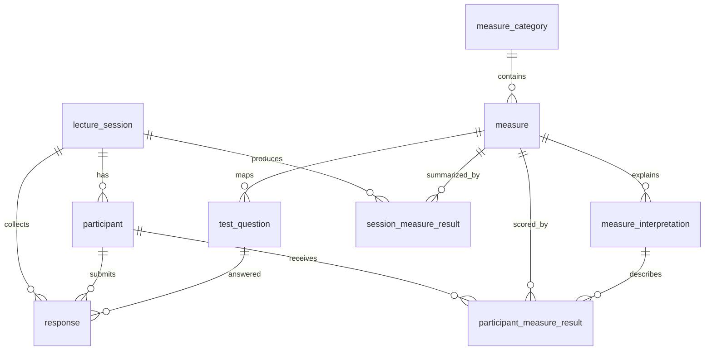

# LectureTCI 데이터 모델 설계

## 1. 설계 방향

LectureTCI는 강의 중 1~2시간 사용하는 참여형 검사 도구이다. 초기 운영에서는 검사 종류를 하나로 고정하고, 복잡한 테스트셋/문항은행 관리는 두지 않는다.

핵심 구조는 다음과 같다.

- 강사가 강의 세션을 만든다.
- 강의 전에 참여자 ID를 미리 생성한다.
- 참여자는 고정 URL에서 강의 코드와 참여자 ID로 입장한다.
- 참여자는 질문별로 응답한다.
- 여러 질문 응답이 하나의 척도(measure) 점수로 집계된다.
- 척도는 카테고리에 속한다.
- 참여자 점수에 따라 적절한 level과 해석 설명을 `measure_interpretation`에서 참조한다.
- 강의 종료 후 결과 데이터는 삭제할 수 있는 임시 운영 데이터를 전제로 한다.

## 2. 주요 결정사항

| 항목 | 결정 |
|---|---|
| 검사 종류 | 1개만 관리 |
| 테스트셋 | 사용하지 않음 |
| 테스트 항목 별도 관리 | 사용하지 않음 |
| 질문과 척도 관계 | 질문은 하나의 measure를 가진다 |
| 척도와 카테고리 관계 | measure는 하나의 category를 가진다 |
| 참여자 ID | 강의 전에 생성한 ID를 사용 |
| display_id | 사용하지 않음 |
| access_token | 사용하지 않음 |
| 결과 조회 | 강의 세션 + 참여자 ID 기준 |
| 결과 해석 | 점수에 맞는 `measure_interpretation` 참조 |

## 3. 척도 구조

### 3.1 카테고리

| 코드 | 카테고리명 | 포함 척도 |
|---|---|---|
| A | 방어성 척도 | 방어성 |
| B | 직무환경 척도 | 조직풍토, 직무자율성, 직무스트레스, 이직의도, 직무소진 |
| C | 성격 | 성실성, 친화성, 낙관성, 편집성, 회피성, 공격성 |
| D | 심리적 웰빙 | 심리적 안녕감, 불안과 우울, 신체화 |
| E | 조직화 | 주의집중 문제, 실행기능 |
| F | 스트레스 대응전략 | 인지적 유연성, 대처능력 |

### 3.2 척도

| measure_id | 원래 번호 | 카테고리 | 척도명 | 표시 순서 |
|---|---|---|---|---:|
| defe | 1.1 | A | 방어성 | 1 |
| clim | 2.1 | B | 조직풍토 | 2 |
| auto | 2.2 | B | 직무자율성 | 3 |
| stre | 2.3 | B | 직무스트레스 | 4 |
| turn | 2.4 | B | 이직의도 | 5 |
| burn | 2.5 | B | 직무소진 | 6 |
| cons | 3.1 | C | 성실성 | 7 |
| agre | 3.2 | C | 친화성 | 8 |
| opti | 3.3 | C | 낙관성 | 9 |
| para | 3.4 | C | 편집성 | 10 |
| avoi | 3.5 | C | 회피성 | 11 |
| aggr | 3.6 | C | 공격성 | 12 |
| stab | 4.1 | D | 심리적 안녕감 | 13 |
| anxi | 4.2 | D | 불안과 우울 | 14 |
| soma | 4.3 | D | 신체화 | 15 |
| adhd | 5.1 | E | 주의집중 문제 | 16 |
| exec | 5.2 | E | 실행기능 | 17 |
| flex | 6.1 | F | 인지적 유연성 | 18 |
| mana | 6.2 | F | 대처능력 | 19 |

## 4. 테이블 목록

| 테이블 | 역할 |
|---|---|
| lecture_session | 강의 체험 세션 |
| participant | 세션별 참여자 ID |
| measure_category | 결과 카테고리 마스터 |
| measure | 척도 마스터 |
| measure_interpretation | 척도별 점수 구간/level/해석 설명 |
| test_question | 단일 테스트의 질문 |
| response | 참여자별 질문 응답 |
| session_measure_result | 세션 전체의 척도별 결과 |
| participant_measure_result | 참여자별 척도 결과 |

## 5. 테이블 상세

### 5.1 lecture_session

강의 체험 1회 단위이다.

| 컬럼 | 타입 | 필수 | 설명 |
|---|---|---:|---|
| id | uuid | Y | 세션 ID |
| session_code | text | Y | 참여자 입장 코드, 6자리 숫자 |
| title | text | N | 강의/체험 제목 |
| status | text | Y | ready, active, closed, published |
| expected_participant_count | integer | N | 생성 예정 참여자 수 |
| started_at | timestamptz | N | 체험 시작 일시 |
| closed_at | timestamptz | N | 입력 종료 일시 |
| published_at | timestamptz | N | 결과 공개 일시 |
| created_at | timestamptz | Y | 생성 일시 |
| updated_at | timestamptz | Y | 수정 일시 |

### 5.2 participant

강의 전에 생성하는 참여자 ID 목록이다. `display_id`와 별도 내부 ID를 두지 않고, 강의 세션 안에서 `participant_id`를 직접 사용한다.

| 컬럼 | 타입 | 필수 | 설명 |
|---|---|---:|---|
| lecture_session_id | uuid | Y | 세션 ID |
| participant_id | text | Y | 참여자 ID, 예: P001 |
| status | text | Y | ready, joined, in_progress, submitted |
| progress_percent | integer | Y | 입력 진행률 |
| created_at | timestamptz | Y | 생성 일시 |
| joined_at | timestamptz | N | 최초 입장 일시 |
| submitted_at | timestamptz | N | 제출 일시 |

기본키:

```text
primary key (lecture_session_id, participant_id)
```

### 5.3 measure_category

결과 화면의 상위 카테고리이다.

| 컬럼 | 타입 | 필수 | 설명 |
|---|---|---:|---|
| id | text | Y | 카테고리 코드, 예: A |
| name | text | Y | 카테고리명 |
| description | text | N | 카테고리 설명 |
| sort_order | integer | Y | 표시 순서 |
| created_at | timestamptz | Y | 생성 일시 |
| updated_at | timestamptz | Y | 수정 일시 |

### 5.4 measure

결과 산출 단위인 척도이다.

| 컬럼 | 타입 | 필수 | 설명 |
|---|---|---:|---|
| id | text | Y | 척도 코드, 예: clim |
| category_id | text | Y | 카테고리 코드 |
| name | text | Y | 척도명 |
| short_name | text | N | 그래프 표시용 짧은 이름 |
| definition_text | text | N | 척도 설명 |
| score_direction | text | Y | high_positive 또는 high_risk |
| sort_order | integer | Y | 카테고리 내 표시 순서 |
| created_at | timestamptz | Y | 생성 일시 |
| updated_at | timestamptz | Y | 수정 일시 |

`score_direction`은 점수가 높을 때 긍정적인 척도인지, 위험/부담이 큰 척도인지를 구분하기 위한 값이다.

### 5.5 measure_interpretation

척도별 점수 구간에 따른 level과 결과 설명이다. 참여자별 결과 화면은 계산된 점수에 맞는 row를 찾아 level, 색상, 설명을 표시한다.

| 컬럼 | 타입 | 필수 | 설명 |
|---|---|---:|---|
| measure_id | text | Y | 척도 코드 |
| level_code | text | Y | green, yellow, red |
| level_label | text | Y | 표시명 |
| min_score | numeric | Y | 구간 최소값 |
| max_score | numeric | Y | 구간 최대값 |
| color_hex | text | Y | 화면 표시 색상 |
| icon_name | text | N | 아이콘명 |
| description | text | Y | 결과 해석문 |
| sort_order | integer | Y | 구간 표시 순서 |
| created_at | timestamptz | Y | 생성 일시 |
| updated_at | timestamptz | Y | 수정 일시 |

기본키:

```text
primary key (measure_id, level_code)
```

주의:

- 점수 구간은 척도별로 겹치지 않게 관리한다.
- 계산 결과에는 `level_code`를 함께 저장하여 결과 재현성을 높인다.

### 5.6 test_question

단일 테스트의 질문 목록이다. 별도 테스트셋 없이 전체 질문을 한 묶음으로 관리한다.

| 컬럼 | 타입 | 필수 | 설명 |
|---|---|---:|---|
| id | uuid | Y | 질문 ID |
| question_no | integer | Y | 질문 번호 |
| measure_id | text | Y | 연결 척도 |
| question_text | text | Y | 질문 문구 |
| scale_min | integer | Y | 응답 최소값 |
| scale_max | integer | Y | 응답 최대값 |
| reverse_score | boolean | Y | 역채점 여부 |
| weight | numeric | Y | 계산 가중치 |
| is_active | boolean | Y | 사용 여부 |
| created_at | timestamptz | Y | 생성 일시 |
| updated_at | timestamptz | Y | 수정 일시 |

### 5.7 response

참여자별 질문 응답 원본이다.

| 컬럼 | 타입 | 필수 | 설명 |
|---|---|---:|---|
| lecture_session_id | uuid | Y | 세션 ID |
| participant_id | text | Y | 참여자 ID |
| question_id | uuid | Y | 질문 ID |
| answer_value | numeric | Y | 원본 응답값 |
| answered_at | timestamptz | Y | 응답 일시 |
| updated_at | timestamptz | Y | 수정 일시 |

기본키:

```text
primary key (lecture_session_id, participant_id, question_id)
```

### 5.8 session_measure_result

세션 전체 참여자의 척도별 결과이다.

| 컬럼 | 타입 | 필수 | 설명 |
|---|---|---:|---|
| lecture_session_id | uuid | Y | 세션 ID |
| measure_id | text | Y | 척도 코드 |
| participant_count | integer | Y | 계산 대상 참여자 수 |
| score_sum | numeric | Y | 점수 합계 |
| score_avg | numeric | Y | 평균 점수 |
| score_100 | numeric | Y | 0~100 환산 점수 |
| level_code | text | N | 전체 평균 기준 level |
| calculated_at | timestamptz | Y | 계산 일시 |

기본키:

```text
primary key (lecture_session_id, measure_id)
```

### 5.9 participant_measure_result

참여자별 척도 결과이다. 결과 화면은 이 테이블과 `measure`, `measure_category`, `measure_interpretation`을 조합해 표시한다.

| 컬럼 | 타입 | 필수 | 설명 |
|---|---|---:|---|
| lecture_session_id | uuid | Y | 세션 ID |
| participant_id | text | Y | 참여자 ID |
| measure_id | text | Y | 척도 코드 |
| question_count | integer | Y | 계산에 사용된 질문 수 |
| score_sum | numeric | Y | 점수 합계 |
| score_avg | numeric | Y | 평균 점수 |
| score_100 | numeric | Y | 0~100 환산 점수 |
| level_code | text | Y | green, yellow, red |
| calculated_at | timestamptz | Y | 계산 일시 |

기본키:

```text
primary key (lecture_session_id, participant_id, measure_id)
```

## 6. 결과 표시 흐름

1. 참여자 응답을 `response`에 저장한다.
2. 입력 종료 후 척도별 점수를 계산한다.
3. 세션 전체 평균 결과를 `session_measure_result`에 저장한다.
4. 참여자별 척도 결과를 `participant_measure_result`에 저장한다.
5. 각 결과의 `score_100`을 기준으로 `measure_interpretation`에서 level과 설명을 찾는다.
6. 결과 화면은 카테고리별로 measure를 묶어 다음 정보를 표시한다.

```text
카테고리명
  척도명
  점수
  level 색상
  가로 막대그래프
  척도 정의
  level별 해석 설명
```

## 7. 관계도



## 8. Supabase DDL

Supabase PostgreSQL용 DDL 초안은 [database/schema.sql](database/schema.sql)에 둔다.

## 9. 남은 결정사항

- 점수 계산 공식
- 역채점 공식
- Green/Yellow/Red 구간 기준
- 척도별 해석문 원문
- 참여자 ID 자동 생성 규칙
- 강의 종료 후 데이터 삭제 정책
