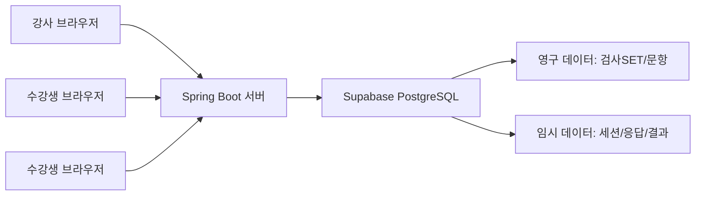

# LectureTCI 아키텍처 설계 방향

## 1. 요구사항 검토 요약

LectureTCI는 TCI 검사 자체를 운영하는 서비스라기보다, 강의 중 수강생들이 검사 예시를 체험하고 결과를 확인하는 참여형 웹 화면입니다.

핵심 특징은 다음과 같습니다.

- 강사는 검사SET와 검사항목을 관리한다.
- 강사는 강의 중 하나의 검사SET를 선택해 체험 세션을 시작한다.
- 수강생은 공유 URL로 접속해 임시 ID를 입력하고 문항에 응답한다.
- 강사는 참여자의 진행 상태를 확인하고, 입력 종료/결과 취합/결과 공유를 제어한다.
- 참여자의 ID, 응답, 결과는 강의 종료 후 폐기한다.
- 첫 버전은 실제 데이터 처리보다 화면 디자인과 버튼 네비게이션을 우선 구현한다.

## 2. 중요한 설계 판단

### 확정 아키텍처 방향

LectureTCI의 운영 버전은 다음 구조를 기본 방향으로 정합니다.

```text
브라우저
  ↓
Spring Boot 서버
  ↓
Supabase PostgreSQL
```

Spring Boot가 중간 서버 역할을 맡고, 브라우저는 Supabase에 직접 접속하지 않습니다.

이 구조를 선택하는 이유:

- Supabase 접속 키와 민감한 설정을 브라우저에 노출하지 않는다.
- 관리자 인증, 세션 제어, 결과 취합, 임시 데이터 삭제를 서버에서 통제한다.
- Supabase의 웹 콘솔과 PostgreSQL 장점을 활용할 수 있다.
- 나중에 실제 배포와 반복 운영으로 확장하기 쉽다.
- 100명 규모의 참여형 강의에는 단일 Spring Boot 서버와 Supabase PostgreSQL 조합으로 충분하다.

### 정적 HTML만으로 가능한 범위

첫 번째 버전의 화면 디자인, 버튼 네비게이션, 예시 데이터 기반 흐름은 정적 HTML/CSS/JavaScript로 충분합니다.

가능한 것:

- 진행자 화면 목업
- 참여자 ID 입력 화면
- 검사 문항 입력 화면
- 결과보기 버튼과 결과 화면
- 테스트용 MBTI 유사 예시 데이터
- 로컬 브라우저에서 화면 흐름 확인

어려운 것:

- 100명 동시 접속 상태 공유
- 강사가 입력 종료를 누르면 모든 참여자 화면이 즉시 막히는 기능
- 참여자별 진행 상태 실시간 집계
- 결과 공유 버튼 활성화의 실시간 반영
- 강의 종료 후 서버 메모리/DB 데이터 폐기

따라서 개발은 정적 프로토타입으로 시작하되, 실제 운영 버전은 서버가 있는 웹앱 구조가 필요합니다.

## 3. 권장 개발 단계

### Phase 1. 화면 프로토타입

목표: 기능 구현 전, 전체 사용 흐름과 모바일 UI를 확정합니다.

기술:

- HTML
- CSS
- Vanilla JavaScript
- 브라우저 localStorage 또는 메모리 기반 예시 데이터
- GitHub Pages 배포

구현 화면:

- 진행자 홈
- 검사SET 관리 화면
- 검사항목 관리 화면
- 체험 진행 관리 화면
- 참여자 ID 입력 화면
- 참여자 검사 화면
- 참여자 결과 화면

이 단계에서는 실제 다중 사용자 동기화는 구현하지 않고, 버튼을 누르면 다음 상태로 이동하는 시뮬레이션으로 만듭니다.

프로토타입은 로컬 파일로만 확인하지 않고 GitHub Pages에 배포합니다. 강사, 사용자, 관계자와 URL을 공유해 모바일 화면과 전체 흐름을 함께 검토하기 위함입니다.

### Phase 2. 단일 서버 MVP

목표: 실제 강의에서 100명 정도가 동시에 접속해 사용할 수 있는 최소 운영 버전을 만듭니다.

권장 기술:

- Backend: Spring Boot
- Frontend: HTML + CSS + Vanilla JavaScript
- Database: Supabase PostgreSQL Free
- Hosting: Google Cloud Run
- Realtime: 첫 MVP는 2~3초 polling, 필요 시 WebSocket/SSE 또는 Supabase Realtime 검토

Spring Boot를 추천하는 이유:

- 관리자 암호, 세션, 데이터베이스, 배포 구조를 한 프로젝트 안에서 관리하기 쉽다.
- 100명 규모의 실시간 상태 공유에 충분하다.
- 추후 기능 확장이 정적 HTML보다 훨씬 안정적이다.
- Supabase service role key 같은 민감한 값을 서버 안에만 보관할 수 있다.

운영 1차 배포는 Google Cloud Run + Spring Boot + Supabase Free 조합으로 시작합니다. 분기별 1회, 1~2시간 정도 사용하는 패턴이므로 항상 켜져 있는 서버보다 사용량 기반 과금이 가능한 Cloud Run이 적합합니다.

### Phase 3. 운영 안정화

목표: 반복 강의, 검사SET 관리, 배포, 백업, 관리자 보안을 안정화합니다.

추가 기능:

- 관리자 로그인
- 검사SET/문항 CRUD
- 강의 세션 생성/종료
- 세션별 임시 데이터 자동 폐기
- 결과 화면 모바일 최적화
- 세션 만료 처리
- 간단한 운영 로그
- 사용량, 비용, 관리 불편함을 보고 서버 이전 여부 검토

## 4. 추천 시스템 구조



영구 저장 데이터와 임시 데이터를 분리하는 것이 중요합니다.

영구 데이터:

- 검사SET
- 검사항목
- 문항별 배점
- 정렬순서

임시 데이터:

- 강의 세션
- 참여자 임시 ID
- 참여자 응답
- 진행 상태
- 개인별 결과

강의 종료 시 임시 데이터는 삭제하고, 검사SET와 문항 데이터만 남깁니다.

브라우저는 Spring Boot API만 호출합니다. Supabase anon key, service role key, DB 접속 정보는 브라우저에 전달하지 않습니다.

## 5. 데이터 모델 초안

### test_sets

검사SET를 저장합니다.

- id
- name
- description
- created_at
- updated_at

### test_items

검사SET별 문항을 저장합니다.

- id
- test_set_id
- question_text
- score_key
- sort_order
- memo

### lecture_sessions

강의 중 열리는 체험 세션입니다.

- id
- test_set_id
- session_code
- status
- created_at
- closed_at

status 예시:

- ready
- collecting
- input_closed
- scored
- result_shared
- ended

### participants

세션 안에서만 유지되는 참여자 정보입니다.

- id
- session_id
- display_id
- status
- joined_at
- completed_at

status 예시:

- not_started
- in_progress
- completed

### responses

참여자의 문항별 응답입니다. 강의 종료 후 삭제 대상입니다.

- id
- session_id
- participant_id
- test_item_id
- answer_value
- score_value

### results

취합된 개인별 결과입니다. 강의 종료 후 삭제 대상입니다.

- id
- session_id
- participant_id
- result_json
- created_at

## 6. 실시간 처리 방향

강사 화면은 참여자 진행 상태를 실시간 또는 준실시간으로 봐야 합니다.

첫 MVP 권장안:

- 강사 화면: 2초마다 참여자 상태 조회
- 참여자 화면: 2초마다 세션 상태 조회
- 결과 공유 버튼 활성화 여부도 polling으로 확인
- 모든 API 호출은 Spring Boot를 통해 처리

단순성과 구현 속도를 우선하면 polling이 좋습니다. 100명 규모라면 2~3초 주기의 polling도 충분히 현실적입니다.

나중에 실시간성이 중요해지면 WebSocket, SSE, Supabase Realtime 중 하나로 개선합니다. 다만 첫 운영 버전에서는 polling이 가장 단순하고 예측 가능합니다.

## 7. 화면 구조 제안

### 진행자 화면

- 검사SET 관리
- 검사항목 관리
- 체험 시작
- 참여 URL 복사
- 참여자 진행 상태 목록
- 입력 종료
- 결과 취합
- 결과 공유
- 체험 종료 및 임시 데이터 삭제

### 참여자 화면

- 임시 ID 입력
- 검사 문항 응답
- 제출 완료 화면
- 결과보기 버튼
- 개인 결과 화면

### 모바일 우선 원칙

참여자 화면은 모바일을 기준으로 설계합니다.

- 한 화면에 한 문항 또는 짧은 문항 묶음
- 큰 선택 버튼
- 현재 진행률 표시
- 제출 전 확인
- 결과 화면은 짧고 명확하게

강사 화면은 PC/태블릿 기준으로 설계해도 됩니다.

## 8. 배포 방향

첫 프로토타입:

- GitHub Pages 사용
- 정적 HTML/CSS/JavaScript만 배포
- 화면 설계와 버튼 네비게이션 검토 목적
- URL을 공유해 PC/모바일에서 함께 검토

실제 운영 MVP:

- Google Cloud Run에 Spring Boot 단일 서버 배포
- Supabase PostgreSQL Free 사용
- Supabase 웹 콘솔로 검사SET/문항 데이터 확인 및 관리 가능
- Spring Boot 서버의 환경변수로 Supabase 접속 정보를 관리
- 강의 시작 전 접속해 Cloud Run 콜드 스타트를 미리 깨우는 방식으로 운영 가능

운영 후 검토:

- 분기별 사용량과 실제 비용 확인
- Cloud Run 설정 난이도와 운영 편의성 확인
- Supabase Free 한도 확인
- 필요 시 Railway, Render, Fly.io 등 다른 서버로 이전 검토

무료 호스팅 조건은 자주 바뀌므로 실제 배포 시점에 다시 확인하는 것이 좋습니다.

## 9. 보안과 개인정보

참여자 ID로 휴대폰 8자리나 이메일을 사용하면 개인정보가 될 수 있습니다.

권장:

- 가능하면 강사가 배부한 임시 코드 사용
- 이메일/전화번호 입력은 피하기
- 강의 종료 시 응답과 결과 즉시 삭제
- 관리자 화면은 암호로 보호
- 세션 URL은 추측하기 어려운 난수 코드 사용
- 브라우저에서 Supabase를 직접 호출하지 않기
- Supabase service role key는 Spring Boot 서버 환경변수에만 저장
- 관리자 API와 참여자 API를 분리
- 세션 코드와 참여자 ID 조합으로 접근 범위를 제한

## 10. Spring Boot와 Supabase 역할 분담

### Frontend

- 강사 화면 표시
- 수강생 화면 표시
- 입력값 검증
- Spring Boot API 호출
- 결과 표시
- 첫 버전은 React 없이 HTML/CSS/Vanilla JavaScript로 구현
- 프로토타입의 정적 리소스를 운영 버전의 Spring Boot static 리소스로 옮겨 재사용

### Spring Boot

- 관리자 인증
- 검사SET/검사항목 CRUD API
- 강의 세션 시작/종료
- 참여 URL 생성
- 참여자 상태 관리
- 응답 저장
- 점수 계산
- 결과 생성
- 결과 공유 상태 변경
- 강의 종료 시 임시 데이터 삭제
- Supabase 접속 정보 보호

### Supabase PostgreSQL

- 검사SET 저장
- 검사항목 저장
- 강의 세션 저장
- 참여자/응답/결과 임시 저장
- Supabase 웹 콘솔을 통한 데이터 확인

Supabase Auth와 Realtime은 첫 버전 필수 기능으로 두지 않습니다. 필요해지면 운영 단계에서 추가 검토합니다.

## 11. 프론트엔드 기술 선택

첫 버전에서는 React를 사용하지 않습니다.

선택 기술:

- HTML
- CSS
- Vanilla JavaScript
- fetch API

React를 사용하지 않는 이유:

- 화면 수가 많지 않다.
- 첫 목표는 복잡한 웹앱이 아니라 강의 중 안정적으로 작동하는 화면이다.
- GitHub Pages 프로토타입을 빠르게 만들 수 있다.
- 이후 Spring Boot의 static 리소스로 자연스럽게 옮길 수 있다.
- React를 도입하면 빌드, 라우팅, 상태관리, 배포 구조가 추가된다.

React는 나중 옵션으로 둡니다.

도입을 검토할 시점:

- 관리자 화면이 복잡해지는 경우
- 검사SET/문항 관리 UI가 커지는 경우
- 여러 강사, 여러 강의, 통계 대시보드가 필요한 경우
- 컴포넌트 재사용과 상태 관리가 많아지는 경우

## 12. 첫 구현 제안

다음 작업은 화면 프로토타입을 만드는 것입니다.

추천 파일 구조:

```text
LectureTCI/
  기능_요구사항.md
  아키텍처_제안.md
  docs/
    index.html
    styles.css
    app.js
    sample-data.js
```

`docs/` 폴더를 사용하는 이유는 GitHub Pages에서 `main` 브랜치의 `/docs` 폴더를 바로 배포 소스로 지정할 수 있기 때문입니다.

첫 프로토타입에 넣을 화면:

- 진행자 대시보드
- 검사SET 관리 화면
- 검사항목 관리 화면
- 체험 진행 화면
- 참여자 ID 입력 화면
- 검사 응답 화면
- 결과 화면

첫 프로토타입의 목적은 “예쁘게 완성”보다 “강의 흐름이 자연스러운지 확인”입니다. 화면 흐름이 맞으면 이후 Spring Boot 기반 MVP로 확장합니다.
